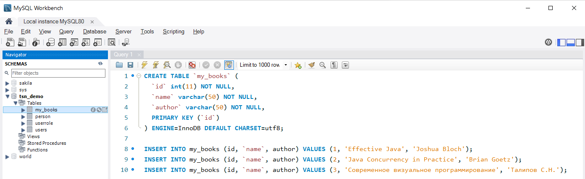

# TSN_JDBC_MYSQL
Простейший пример работы с базой данных MySQL через JDBC в NetBeans




```
CREATE TABLE `my_books` (
  `id` int(11) NOT NULL,
  `name` varchar(50) NOT NULL,
  `author` varchar(50) NOT NULL,
  PRIMARY KEY (`id`)
) ENGINE=InnoDB DEFAULT CHARSET=utf8;

INSERT INTO my_books (id, `name`, author) VALUES (1, 'Effective Java', 'Joshua Bloch');
INSERT INTO my_books (id, `name`, author) VALUES (2, 'Java Concurrency in Practice', 'Brian Goetz');
INSERT INTO my_books (id, `name`, author) VALUES (3, 'Современное визуальное программирование', 'Талипов С.Н.');
```
